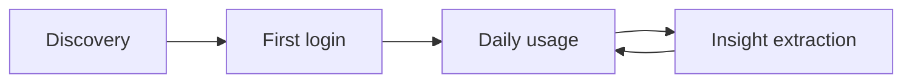

# Core Customer Journey

The pilot journey moves from understanding and trusting Chit to using it daily and extracting explainable insights.

| ID | Stage | Customer goal | Customer action | Chit touchpoint | Successful outcome |
|---|---|---|---|---|---|
| D1 | Discovery | Reduce household coordination effort. | Recognises that calendars, chores, weather and home information are fragmented. | Product introduction or pilot demonstration. | Understands Chit as one shared household overview. |
| D2 | Discovery | Confirm compatibility. | Reviews supported calendars, weather providers, Home Assistant and energy integrations. | Integration catalogue and compatibility guidance. | Identifies at least one calendar and weather source to connect. |
| D3 | Discovery | Assess privacy and trust. | Reviews local deployment, access controls, source labels and screen-safe behaviour. | Privacy explanation and example dashboard. | Understands processing and shared-screen protections. |
| FL1 | First Login | Establish the household. | Creates a household, adds members and assigns roles. | Guided household setup. | Household structure and access roles exist. |
| FL2 | First Login | Connect essential sources. | Connects a calendar, selects a weather location and optionally connects Home Assistant. | Connector flow with permission explanations. | Real calendar and weather data are available. |
| FL3 | First Login | Verify imported information. | Reviews sample events, tasks, weather and device data. | Connection status, source and freshness indicators. | Can identify connected, missing and incomplete sources. |
| FL4 | First Login | Protect shared-screen information. | Enables screen-safe mode and chooses visible details. | Privacy preview and display settings. | Sensitive details are hidden appropriately. |
| FL5 | First Login | Create a useful display. | Confirms display device, cards and layout. | TV/tablet preview and readability check. | Dashboard is ready for household use. |
| DU1 | Daily Usage | Understand today quickly. | Checks weather, events and unfinished chores. | Always-visible dashboard. | Understands the day without opening multiple apps. |
| DU2 | Daily Usage | Anticipate three days. | Reviews commitments, preparation needs and conflicts. | Three-day agenda and week overview. | Identifies what needs coordination. |
| DU3 | Daily Usage | Understand possible availability. | Reviews calendar-supported availability. | Availability card with known and unknown states. | Distinguishes evidence from missing information. |
| DU4 | Daily Usage | Monitor responsibilities and equipment. | Reviews chores, appliance states and schedules. | Chore and appliance cards. | Sees outstanding work without automatic control. |
| DU5 | Daily Usage | Judge information quality. | Checks state, source and last update. | Trust indicators. | Can judge freshness and reliability. |
| IE1 | Insight Extraction | Focus on relevant issues. | Opens prioritised attention cards. | Needs-attention area. | Understands issues without searching the dashboard. |
| IE2 | Insight Extraction | Understand why an item appeared. | Reviews reason, source data and freshness. | Explainability panel. | Can verify relevance. |
| IE3 | Insight Extraction | Make an energy decision. | Compares prices, solar forecast, actual output and schedules. | Energy-context card. | Identifies a suitable time for flexible use. |
| IE4 | Insight Extraction | Act while retaining control. | Coordinates manually or adjusts plans and devices. | Read-only recommendation with acknowledge/dismiss. | Chit supports rather than executes the decision. |

## Journey flow

## Measurement intent

- Discovery: household can explain the proposition, compatibility and privacy model.
- First login: administrator connects minimum sources and publishes a screen-safe view.
- Daily usage: members identify plans, chores, availability and data-quality issues at a glance.
- Insight extraction: users understand why an item appeared and decide what to do without assuming Chit acted.

## Journeys still to define (module expansion)
The journey above covers the pilot household overview. Not yet mapped: couple finance setup and monthly settle-up; parent configures a child's mobile view; child's daily use (school plan, reminders, chores and stars); partner/member onboarding with per-person privacy. Add these as module-level journeys under `docs/modules/<module>/` when their stories are written.

