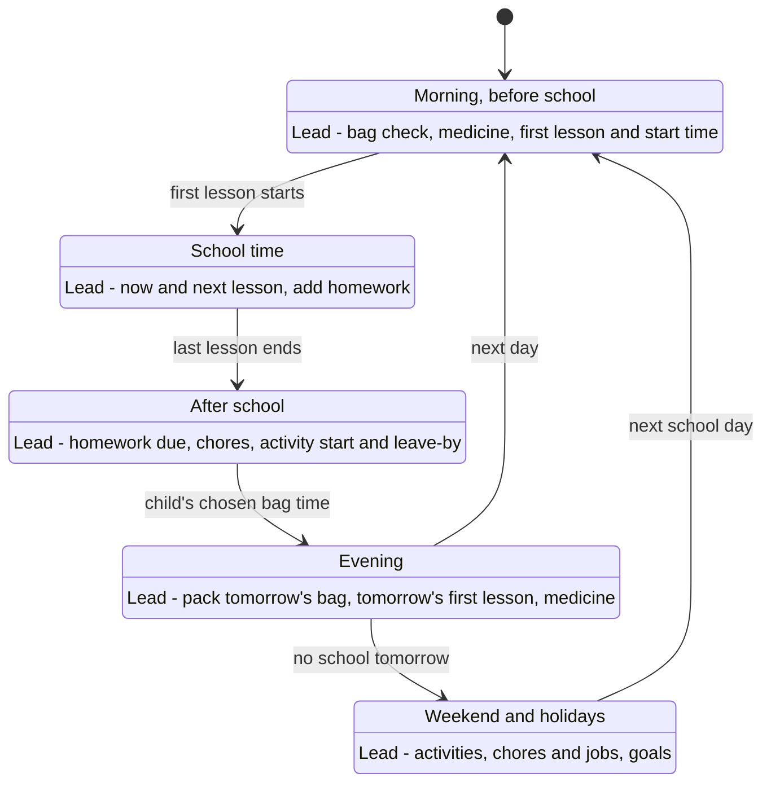
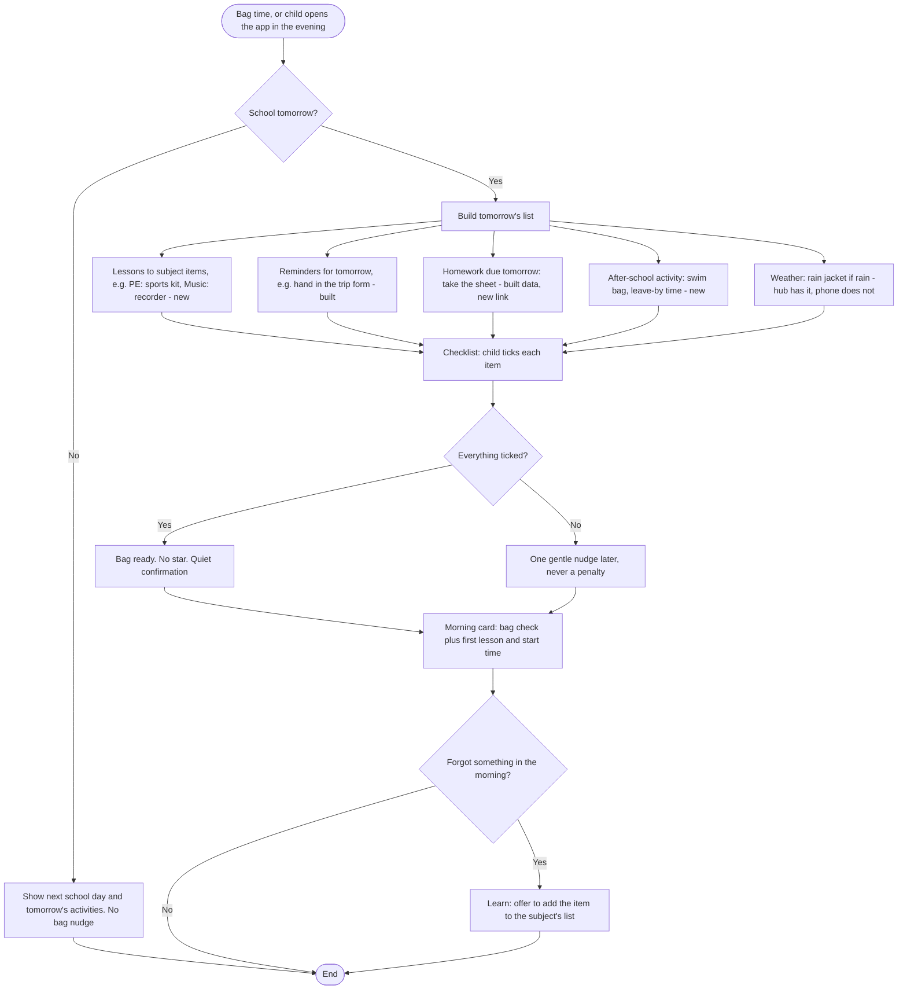
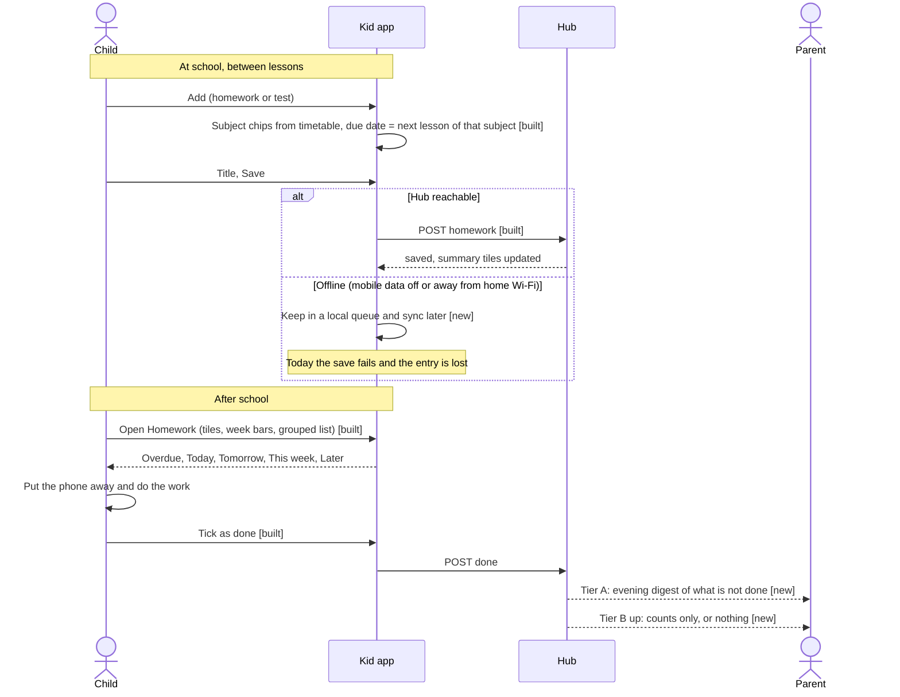
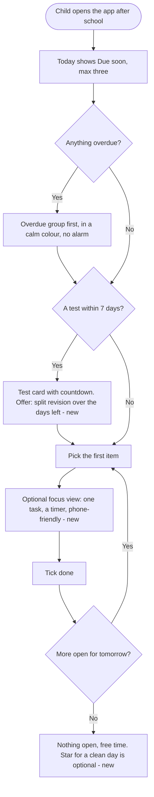
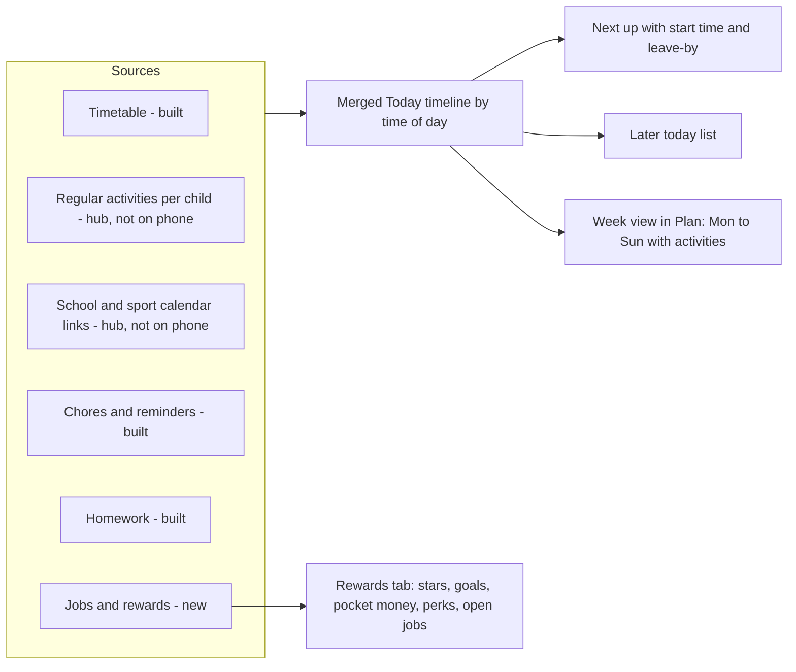
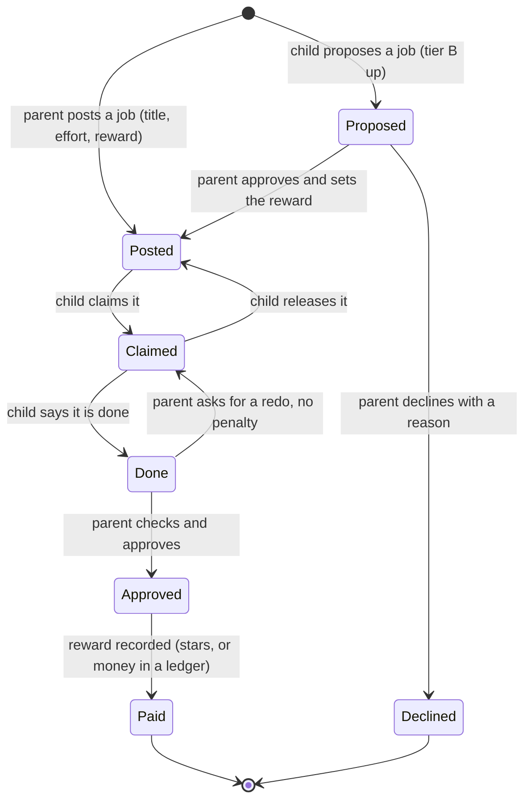
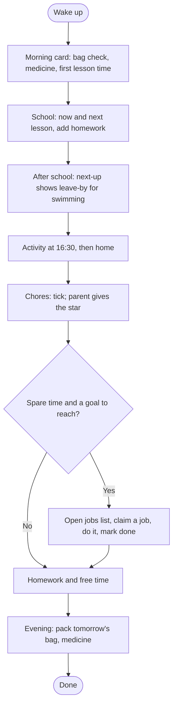

# Kids: the child's experience, age tiers and journeys

- Date: 2026-10-08
- Status: **Design proposal. Hypotheses, not decisions.** Nothing here has been tested with a child. It uses the audit of what is built ([`submodules/kid-view/README.md`](submodules/kid-view/README.md), "What the phone app does today") and the research in [`../00-overview/market-research/04-kids-module-research.md`](../00-overview/market-research/04-kids-module-research.md).
- Surfaces: phone first, tablet second (portrait and landscape). The adult board on the web is out of scope here, except where parents set the rules.
- Evidence limit: no source found says what 10-to-16-year-olds want from a planner app. Every "child priority" below is an assumption to test in sessions with five to eight children (section 9).

## 1. What the research gives us, in six lines

1. Ownership: 63% of German 10–11-year-olds and 79% of 12–13-year-olds have a smartphone (KIM 2024); 37% of 10–11s do not. Pairing on a shared family tablet must work.
2. 82% of phone-owning children take the phone to school; half of parents ban it during homework. The homework screen must work as *plan and tick*, not as something you need while working.
3. Teens accept monitoring when it is introduced openly, is reciprocal and respects autonomy; they resent surveillance (Oxford focus groups, UCF survey). The app must never feel like a tracking tool.
4. Reminders are the best-evidenced feature of children's medication tools; the app currently has none.
5. Parents want school information captured for them, not typed in (F4). Calendar links per child already bring school and sport events to the family view; they do not reach the child's phone.
6. Grade portals cause over-checking; weekly summaries are the healthier default.

## 2. Who the child is, and what they are trying to get done

Four age bands (section 5) share a few jobs. Written as jobs to be done; priority order is our guess.

| # | When… | I want to… | So I can… |
|---|---|---|---|
| J1 | It is the evening before a school day | know exactly what to put in my bag | not be told off, not forget my sports kit |
| J2 | A teacher gives homework or announces a test | write it down in seconds, and see it again after school | do it on time without a parent chasing me |
| J3 | I look at my phone at any point in the day | see what is next, when, where, and what I owe | stop asking "what do I have now?" |
| J4 | I have done something useful at home | see what it earned and what it gets me | feel it counts, and plan toward something |
| J5 | I am getting older | decide more myself, and not feel watched | be trusted |

Emotional jobs matter as much as functional ones. For 10–12-year-olds the feeling to design for is "I have it under control"; for 14–16-year-olds it is "nobody is checking up on me".

## 3. The home screen: what matters most, and when

### 3.1 Information ranking (assumption, to be tested)
| Rank | Information | Why it leads | Built today? |
|---|---|---|---|
| 1 | **What is next**, with start time, place, and "leave by" if it needs travel | Answers "what now?" without opening anything | Lessons only; no activities, no leave-by |
| 2 | **What I need to bring or do before I go** (bag, kit, form, medicine) | Prevents the most common failure | Reminders only; nothing derived or tickable |
| 3 | **What is due soon** (homework, tests) | The main source of conflict with parents | Yes (up to four items) |
| 4 | **What I can do now to earn** (chores, extra jobs) | Motivation and money | Chores only |
| 5 | **Stars, goals, money** | Reward, but not urgent | Stars and goals; no money, no perks |
| 6 | **Grades** | High emotional weight; not a daily task | Yes, if shared |
| 7 | **Health** | Private, essential for those who need it | Yes, read-only, no reminders |

### 3.2 The screen changes with the time of day
The app already changes colour by hour. Proposed: it also changes **what leads**.



### 3.3 Phone layout (proposed order of the Today screen)
```
┌──────────────────────────────┐
│ Good afternoon, Mila    (M)  │  greeting, avatar opens "About me"
├──────────────────────────────┤
│ NEXT UP                      │  one card; changes with the mode above
│ Swimming 16:30 · leave 16:05 │  lesson, activity, or "bag time"
│ Pool, Bahnhofstr.  [bike 12′]│
├──────────────────────────────┤
│ BEFORE YOU GO   ☐ swim bag   │  checklist, only when there is something
│                 ☐ trip form  │
├──────────────────────────────┤
│ DUE SOON                     │  max three; tests show a countdown
│ ○ Maths worksheet  tomorrow  │
│ ⚑ English test     in 6 days │
├──────────────────────────────┤
│ LATER TODAY  (merged)        │  lessons, activities, chores by time
│ 16:30 Swimming               │
│ 18:00 Set the table  ★+1     │
├──────────────────────────────┤
│ EARN   2 jobs open   ★ 23    │  strip; opens the jobs list
├──────────────────────────────┤
│ 🔒 Your parents choose what  │
│    shows up here.            │
└──────────────────────────────┘
 Today · Plan · Homework · Rewards · Me     bottom navigation
```
Navigation proposal: today's six tabs (Today, Timetable, Homework, Stars, Grades, Health) become **five** (Today, Plan, Homework, Rewards, Me). *Plan* = week timetable plus activities. *Rewards* = stars, goals, money, perks and jobs. *Me* = grades, health, settings, "what my parents can see". Grades and health move behind *Me* because they are not daily tasks and are the most sensitive; a parent can still pin either to Today. Rationale, not evidence: five tabs fit one thumb and the least-used items are the most private.

### 3.4 Tablet layout
- **Landscape:** two panes. Left: Today timeline (merged lessons, activities, chores). Right: the selected tab (homework list, week plan or rewards).
- **Portrait:** the phone layout with a wider column and larger type.
- Remove the portrait lock from the manifest, raise the 520 px cap to about 840 px with the two-pane layout above 700 px, and allow pinch zoom (remove `user-scalable=no`).
- A **shared family tablet** can be paired as a child's device (37% of 10–11s have no phone). On a shared device the sensitive sections (grades, health) should require the child to confirm they are the one looking (a tap and hold, or a PIN set by the child).

## 4. What the child can configure, and what only a parent can

Principle: **a parent controls what exists on the child's screen; the child controls how it looks, when it nags, and how it is arranged.** The child can never reveal what a parent hid, and a parent can never change something silently.

| Setting | Child | Parent | Notes |
|---|:-:|:-:|---|
| Which sections exist (timetable, homework, grades, health, rewards…) | | ✔ | Today's six switches |
| Order and visibility of Today's blocks, within what the parent allowed | ✔ | | New |
| Pin a section (grades, health) to Today | ✔ if allowed | ✔ | New |
| Bag-reminder time | ✔ (from tier B up) | ✔ default | New |
| Which reminders nudge and when (quiet hours) | ✔ (tier B up) | ✔ | Needs push |
| Items for each subject (PE → sports kit, Music → recorder) | ✔ with parent | ✔ | New, drives the bag list |
| Subject colours, accent colour, light or dark | ✔ | | New |
| Language | ✔ | ✔ | Needs translation |
| Add, tick and delete **own** homework | ✔ | | Built |
| Delete a parent's homework entry | | ✔ | Built |
| Tick a chore | ✔ | | Built |
| Award a star, approve a goal, approve a job | | ✔ (until tier C) | Built for stars |
| Propose a goal or a job | ✔ (tier B up) | approves | New |
| **What my parents can see** screen | ✔ | | Partly built: "About me" lists shared sections but not what parents see of the child's own activity |
| Remove this device | ✔ | ✔ | Child can remove; parent can always revoke |
| Pair a new device | with parent | ✔ | D tier: child can request |

**The missing axis.** Today there is one control per section: does the child see it. There is no control for the other direction: **what does the parent see of the child's own use** (homework titles, ticks, grades, medicine log)? Today the answer is "everything". The age tiers below need two axes per section:

| Level | Child sees | Parent sees |
|---|---|---|
| Off | no | no |
| Child only | yes | no |
| Child + summary | yes | counts and flags only ("2 overdue") |
| Child + detail | yes | full detail |

## 5. Age tiers: how much support, when

Bands are **defaults**, set from the member's birth date (already stored, not yet used) and always overridable. They are presets for the switches above, not locks. On a birthday, or when the child changes school, the parent sees "Mila is 13 now. Review what the app shows?" Moving up a tier **never** removes anything the child already sees; it reduces what the parent sees.

| | **A. Guided** (10–11) | **B. Shared** (12–13) | **C. Trusted** (14–15) | **D. Independent** (16+) |
|---|---|---|---|---|
| Parent role | Coach: sets it up, checks daily | Co-pilot: checks a few times a week | Consultant: weekly review, on request | On request only |
| Who sets sections | Parent | Parent, with the child's say | Child proposes, parent approves | Child sets own view; parent keeps the list of shared sections |
| **Bag and reminders** | Parent sets items and times | Child can change times and items | Child owns | Child owns |
| **Homework** | Child adds; parent sees titles; "not done by evening" digest | Child adds; parent sees titles | Child + summary (counts, overdue, tests) | Child only; tests shared if child agrees |
| **Chores and stars** | Parent confirms each | Parent confirms in a batch | "Trust mode": child confirms, parent spot-checks | Chores become jobs (below) |
| **Pocket money / jobs** | Parent-posted jobs only | Child can propose jobs | Child keeps own plan and budget | Child tracks own balance |
| **Grades** | Parent-only, child sees none | Child sees averages once the parent turns it on | Child sees by default | Child owns; parent sees a summary the child agrees to |
| **Medicine** | Parent-managed; child sees "take now"; parent logs | Child ticks; parent alerted when missed | Child self-manages; alert after a longer delay | Private; parent alert opt-in. A clinically critical medicine always alerts, and the child is told |
| **Parent sees activity detail** | full | titles, no free text | summary | summary the child agrees to |
| **Changes in sharing** | Child is told | Child is told | Child is told and can object | Needs the child's agreement |
| **Device pairing** | Parent pairs, parent removes | same | Child can request a re-pair | same |
| **Look and tone** | Playful, large type, stars and confetti | Mostly playful | Calmer, denser | Plain; stars and animation optional |

Notes:
- **Not by age alone.** Maturity, special needs, and a child who struggles with organisation may need tier A at 13; one who is very capable may be at C at 12. The tier is a starting point.
- **Medicine safety.** The research supports reminders and missed-dose alerts for children's medicines. At every tier a medicine marked "critical" keeps an alert path to an adult. The child is told this on the "what my parents can see" screen.
- **Sensitive data on shared screens** stays hidden at every tier (existing rule).
- **Legal and safeguarding review.** Age thresholds for data consent differ by country and by data type. Do not publish the tier ages as policy before a legal review for the launch market.
- **Evidence for stepping down.** Oxford: acceptance depends on respect for autonomy and openness; UCF: control apps were linked with more online risk and poor ratings from teens. The tiers are the design response, but the specific ages are our guess.

## 6. The three journeys (use-case flows)

Every flow marks **[built]**, **[partial]** or **[new]** against the audit.

### 6.1 Journey 1: pack tomorrow's bag from tomorrow's school plan

**Goal:** the child packs the right bag in under two minutes, without a parent asking.
**Trigger:** the child's chosen bag time (default 19:30), or opening the app in the evening.
**Data used:** tomorrow's lessons [built], a per-subject item list [new], tomorrow's reminders [built], homework due tomorrow [built], tomorrow's activities and feed events [new to the phone], tomorrow's weather [built in the hub, not on the phone].



**Edge cases and decisions**
- Timetable not shared, or empty: show only reminders and homework; say the bag list is unavailable and never guess.
- Substitution or timetable change: the app can only show what a parent entered (data state `manual`). A parent edit after bag time must update the checklist and re-nudge once.
- Friday evening: the "next school day" logic already exists; pack for Monday.
- Parent visibility: tier A, parent sees "bag ready: yes or no". Tier B up: nothing unless the child shares.
- Items per subject are **editable by the child and parent**, seeded from common lists; items are never inferred silently.

**Gap summary:** item list per subject, derived checklist with ticks (state kept per day), activity data on the phone, push at bag time, weather on the phone.

### 6.2 Journey 2: write down homework, then finish it after school

**Goal:** writing it down takes under 20 seconds in a corridor; after school the child knows what to do first.
**Constraint from the research:** half of parents ban the phone during homework, and children carry phones to school (82%). Capture happens at school; execution happens with the phone put away.



**The after-school decision flow**


**Design decisions**
- A test is a task whose date counts down (built). The proposed revision split ("3 chapters, 3 days") is a suggestion the child can ignore, never an automatic schedule.
- A parent's own entries (for example from a school letter) can be ticked by the child but only deleted by a parent (built).
- Weekly digest for parents, not live dashboards, for the over-checking reasons in the research.

**Gap summary:** offline queue for add and tick; parent digest by tier; revision split for tests; optional focus view; push "due tomorrow" at a time the child chooses.

### 6.3 Journey 3: my whole day and week, and the ways to earn

**Goal:** one place for start times, chores, reminders, activities, rewards and extra jobs; the child never has to ask a parent "what's on?" or "can I earn something?".



**Earning opportunities: the job lifecycle (new)**


**A day, end to end**


**Open design question: one currency or two?** This needs a product decision.
| Option | How it works | For | Against |
|---|---|---|---|
| **1. Stars only (today)** | Stars toward goals and perks, never spent | Simple; no money handling; already built | No pocket money; "perks" do not exist yet |
| **2. Stars plus a pocket-money ledger** | Parents record what was paid, outside Chit (cash or bank transfer); Chit keeps a balance as a record | Familiar to parents; no payments, so not regulated | Two currencies confuse; ledger needs trust |
| **3. One currency with a parent-set exchange rate** | Stars carry a value ("10 stars ≈ €1") shown beside the balance | One thing to understand; money optional | Changing the rate feels like moving the goalposts |
| **4. Perks catalogue only** | Stars are spent in a menu of perks (screen time, trip, treat) | Matches the original Purpose line | Spending contradicts "stars only grow" and "never taken away" |

Recommendation: **option 3, with option 1 as the default**. Keep one currency (stars). A parent may attach a value, and a perk catalogue sits on top without spending stars (an approved perk is a goal with a cost). A *record-only* ledger is acceptable; real-money payment, a debit card and any regulated flow stay out of scope (see the pricing and missing-feature reports).
Riskiest assumption: that children want pocket money in the app at all, rather than just stars. Cheapest test: ask five families what the child gets today and how it is tracked.

**Gap summary:** activities and feed events on the phone; merged timeline; Plan tab with activities; jobs list and lifecycle; a decision on options 1–4; parent-side screens to post and approve jobs.

## 7. What changes in the data and in the code (for story-writing)

| Item | What is needed | Where it lives |
|---|---|---|
| **K1** Activities and calendar events on the phone | Add them to `GET /api/kids/phone/device/view` under a new share key; apply the child's own filter; include leave-by from commute data | `kid-view/server/routes.py`, planner timeline reader |
| **K2** Subject item lists and a daily bag checklist | A table for items per subject per child; a per-day tick store; a derived list | New migration; `kids/school` or a new submodule |
| **K3** Two-axis visibility and age tiers | Replace six booleans with a level per section (off, child only, summary, detail); a tier preset; birthday prompt | `kid_phone_access`, settings UI, `household` birth date |
| **K4** Offline write queue | Queue homework adds and ticks and chore ticks; sync on reconnect; show "waiting to sync" | `apps/kid-app` |
| **K5** Reminders that reach the phone | Web push over HTTPS; bag time, due tomorrow, medicine | ADR-0012 follow-ups |
| **K6** Child preferences | Block order and visibility, accent, quiet hours, bag time | New child-preferences record |
| **K7** Jobs and reward values | Job lifecycle; optional value on stars; perks as goals | `rewards` |
| **K8** Tablet and accessibility | Remove portrait lock and zoom block; two-pane landscape; accessible names; larger tap targets | `apps/kid-app` |
| **K9** Transparency, completed | "What my parents can see" extended from sections to activity (who sees what level) | `apps/kid-app` Me sheet |
| **K10** Shared-device pairing | A device flagged as shared; confirm-who-is-looking for sensitive sections | `kid_phone` store, app |

Suggested order, by journey value and cost: **K1** (unblocks all three journeys), **K8** (small, correctness), **K2** (Journey 1), **K4** (Journey 2), **K3** (needed before parents can step back), **K5** (needs HTTPS and identity), then **K7**, **K6**, **K9**, **K10**.

## 8. Brainstorm: sharper questions before building

- **Anchoring trap.** The list above assumes the answer is "add more to the phone". The simpler idea is to *remove* things: if the app showed only "next up" and "before you go", would it still need six tabs?
- **Opposite.** What if the child, not the parent, owned the bag list and the parent never saw it? The tier table already points that way from age 12.
- **Who is the user?** At 10 the parent buys the benefit (fewer arguments). At 15 the child is the user and the parent is a guest. The same product has two opposite buyers; the tier is the bridge.
- **Reciprocity.** Offer the child a view of what the parent sees; Oxford found reciprocal designs are accepted more.
- **Could parents also be nudged?** "Mila packed her bag: no need to ask" is a gift to the parent that costs the child nothing.

**Riskiest assumptions** (cheapest test)
1. Children want a bag checklist (watch five children pack a bag with and without it).
2. Children will enter homework in the corridor (a week of logged entries in the owner household).
3. Parents will accept stepping back at the tier thresholds (ask ten parents which tier they would choose for their child's age and why).
4. 14–16-year-olds will keep a parent-paired app at all (five interviews; expect "no" to be a valid answer).

## 9. Research plan for the child's side

| Session | Who | Method | Asks |
|---|---|---|---|
| Walkthrough of the current app (demo mode) | 5–8 children aged 10–16 | 20 minutes, think-aloud on `?demo=1` | What do you open first? what is missing? what would you hide? |
| Bag packing | 5 children 10–13 | Observe a real evening, with and without a checklist prototype | Items, timing, forgetting |
| Homework capture | 5 children | A week of diary entries | When do you write it down? where? |
| Tier choice | 10 parents | Card sort of the tier table | Which tier for my child, and what is missing? |
| Sharing | 5 children 13–16 | Show the "what my parents can see" screen | Trust, acceptance, deal-breakers |

Ethics: sessions with children need parental consent and a plain explanation; no recording without both.

## 10. Open questions for the product owner
1. Pocket money: options 1–4 (section 6.3).
2. Where do age thresholds come from: only birth date, or also a parent-chosen tier?
3. Is shared-device pairing in scope for the pilot?
4. Do we accept a "trust mode" where a child confirms their own chores (tier C), given the current rule that the star is a parent decision?
5. Languages: English only today. German is probably needed for the target households.

## 11. Implementation status (updated 2026-10-08)
The proposal above is unchanged. This table says what has been built from section 7. Hypotheses stay hypotheses until tested with children (section 9).

| Item | Status | Notes |
|---|---|---|
| **K1** Activities and events on the phone | **Built** | Weekly activities with leave-by and escort, plus events from the child's own calendar links, in `GET /api/kids/phone/device/view` under `activities` (share key `activities`). The planner's calendar agenda is read through a new in-process public read (`ctx.read`, `docs/core/cross-module-contracts.md`) and cached ten minutes. Today leads by time of day; Plan tab replaces Timetable. Calendars attached to a child also carry parent-only entries (for example a parents' evening); the filter is per calendar, not per event. |
| **K8** Tablet and accessibility | **Built (first pass)** | Two-pane layout from 760 px, no portrait lock, pinch zoom, accessible names, focus handling, 44 px targets. Needs a real-device and screen-reader check. |
| **K2** Subject items and bag checklist | **Built** | `kid_bag_items`, `kid_bag_ticks`; derived on the hub; edited by child and parent. Weather, bag-time nudge and the parent's "bag ready" view are not built. |
| **K4** Offline write queue | **Built** | Homework, chore, bag ticks and bag item edits. |
| **K3** Two-axis visibility and age tiers | Not built | Needs the product decisions and legal review in section 5 and the open questions in section 10. The six-to-eight on/off switches remain. |
| **K5** Reminders that reach the phone | Not built | Needs HTTPS and web push (ADR-0012 follow-ups). |
| **K6** Child preferences | Not built | The bag time is a constant (19:30) in the app until this lands. |
| **K7** Jobs and reward values | Not built | Waits for the pocket-money decision (section 6.3, open question 1). |
| **K9** Transparency, completed | Not built | The About me sheet lists shared sections only. |
| **K10** Shared-device pairing | Not built | |

Navigation: the six tabs became Today, Plan, Homework, Stars, Grades, Health. The proposed five-tab layout (Rewards and Me) waits for K6 and K7, because moving grades and health behind Me needs the "pin to Today" preference.

Subjects (2026-10-08): the plan is the single source of subjects, each with a name, a code and a type; the phone's week plan shows codes with a c, m or e superscript and homework is picked from the subject list. See `decisions/0001-subjects-come-from-the-plan.md`.

Cards and icons (2026-10-08): the phone offers a two-column card layout with Done and Not relevant for due homework, reminders and chores, activities and events carry icons, and subjects can be merged or removed. Per-child marks and the not-relevant rules are in `submodules/kid-view/README.md`. Not decided here: whether a parent should see that a child marked a reminder done (today the dashboard does not).

